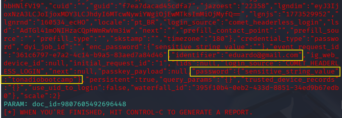

# Desafio: Phishing para capturas de senha
Me chamo Eduardo, e neste desafio do Bootcamp da DIO em parceria com a Santander, Phishing com o objetivo de conseguir as informações de login ao acessar a página

Ao realizar a ação o resultado não é exibido totalmente como o esperado, mas deu certo.

### Resultado do desafio

